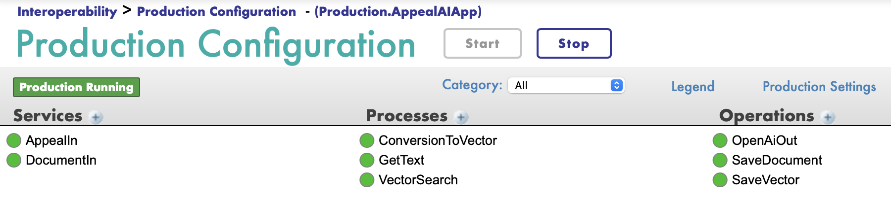
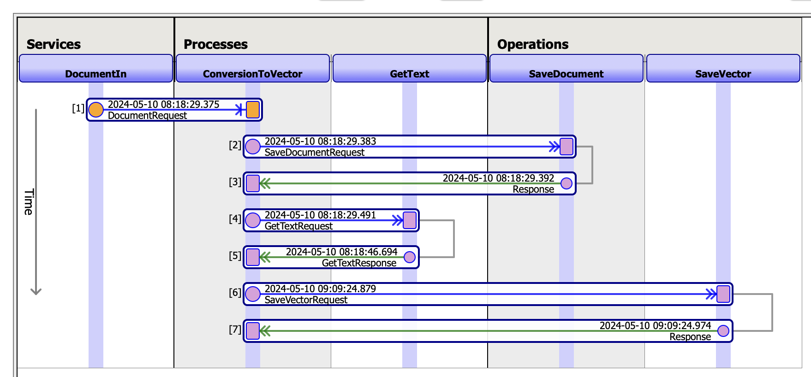
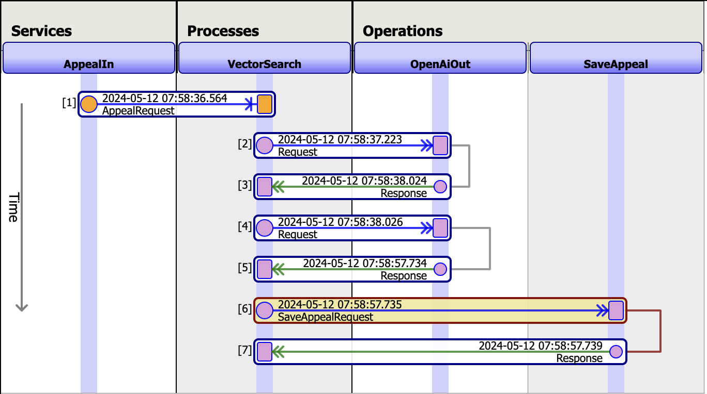
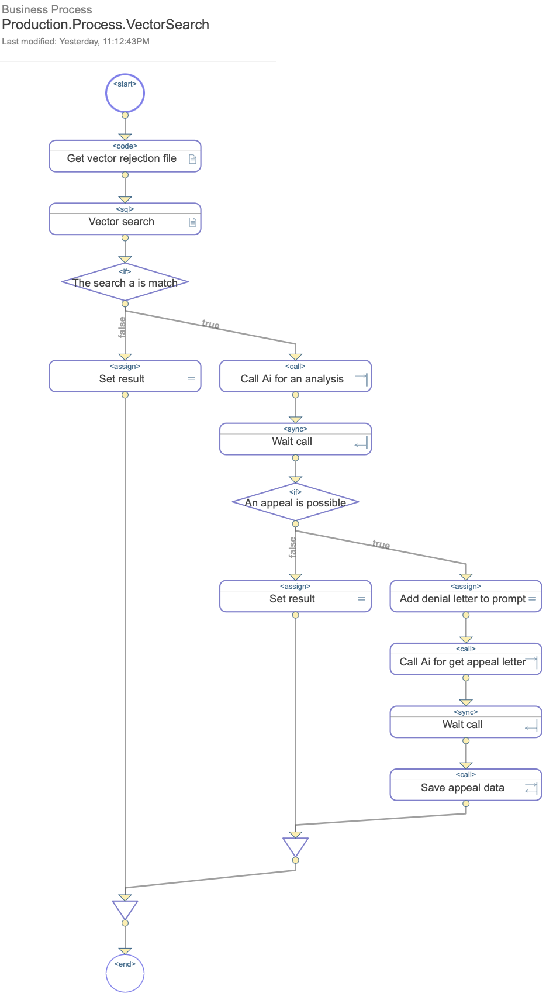
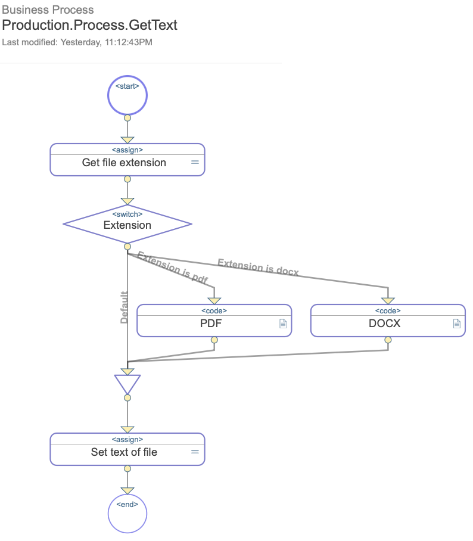
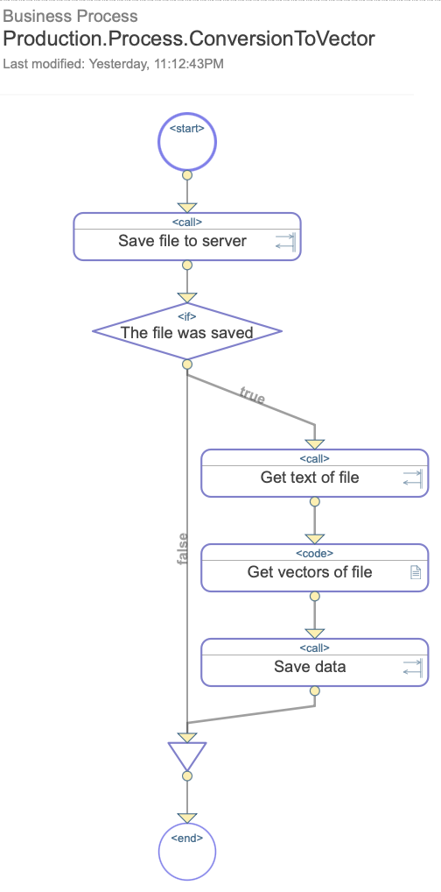

# AppealAI

## Summary

The AppealAI project demonstrates the integration of vector search and generative AI within applications developed using InterSystems technologies. This specific application aims to aid in drafting appeals against insurance company denials for hospital procedures.

### Technologies Used

- **Frontend**: Angular
- **Backend**: IRIS + LangChain + OpenAI

## How to Run

You can install the project using either git or zpm.

1. **Install via GitHub**

- Clone this repository:

```
git clone https://github.com/banksiaglobal/AppealAI.git
```

- Navigate to the directory and run:
```
docker-compose up -d
```


2. **Install via ZPM**

- Run the following command in the InterSystems terminal:
```
zpm "install appeal-ai"
```

- After installing the project, create a new `.env` file in the root folder with the following variables:

```
OPENAI_API_KEY="YOUR_API_KEY"
PATH_SAVE_DOC="/opt/irisapp/"
```

Follow the credential setup described in Step 2 of the article [Tutorial: Adding OpenAI Interoperability to Production](https://community.intersystems.com/post/tutorial-adding-openai-interoperability-production).

## Description of System

### 1. Features

- Creation of insurance company profiles
- Addition of service packages containing necessary documents: insurance contracts, rejection letters, and appeals
- Management of insurance contracts: upload and download functionality
- Management of rejection letters: upload and download functionality
- Processing insurer rejections: system evaluates if an appeal is viable based on insurance contract, patient's medical data, and rejection letter. If possible, it generates a draft appeal letter which can be downloaded.

### 2. API

You can test the application through a demo or using any web client like Postman. In the project root, find the file `AppealAI.postman_collection.json`, which can be imported into Postman for API testing. Note that queries in the collection are sequenced to reflect the logic of actions within the system, requiring sequential execution for correct testing.

### 3. Production

The backend functionality of the application is primarily implemented using Interoperability Production. After successful installation locally, access the Production with the following URL: [http://localhost:32783/csp/healthshare/appealai/EnsPortal.ProductionConfig.zen?PRODUCTION=Production.AppealAIApp](http://localhost:32783/csp/healthshare/appealai/EnsPortal.ProductionConfig.zen?PRODUCTION=Production.AppealAIApp)

- **User**: ``_SYSTEM``
- **Password**: ``SYS``



The Production consist of the following elements:
AppealIn - service that receives the rejection file and sends it for analysis.
DocumentIn - service that receives the insurance contract file and sends it for vectorization.
ConversionToVector - process that converts document text into vectors using LangChain, and invokes process GetText and operations SaveVector, SaveDocument for the corresponding actions.
GetText - process that retrieves text from a document.
VectorSearch - process that performs a vector search and looks for matches between documents, and invokes operations OpenAiOut to analyze an insurance rejection.
OpenAiOut - operation that makes a request to a generative AI - OpenAI.
SaveDocument - operation that stores the document file.
SaveVector - operation that stores document vectors to the database.

The functioning of the system can be seen most clearly in the visual traces.
Visual trace of taking an insurance contract, dividing it into vectors, and storing the vectors in a database (is invoked by requesting "upload insurance contract" from the postman collection, execution time ~ 30 minutes):



Visual trace of receiving a rejection letter, sending requests to OpenAI, and saving the appeal letter if an appeal is possible (is invoked by requesting "upload rejection letter" from the postman collection, execution time ~ 1-2 minutes):



All business processes in the system are implemented as BPL, which helps to understand the logic "behind the scene":





## Developers of Project

- [Maria Nesterenko](https://community.intersystems.com/user/maria-nesterenko): Backend Developer
- [Katsiaryna Shaustruk](https://community.intersystems.com/user/katsiaryna-shaustruk): Frontend Developer
- [Maria Gladkova](https://community.intersystems.com/user/maria-gladkova): Technical Writer

We are the team of Banksia Global company and we always are opened for something new and interesting!

\#BanksiaGlobal #LangChain #VectorSearch #GenerativeAI #AI #Angular

